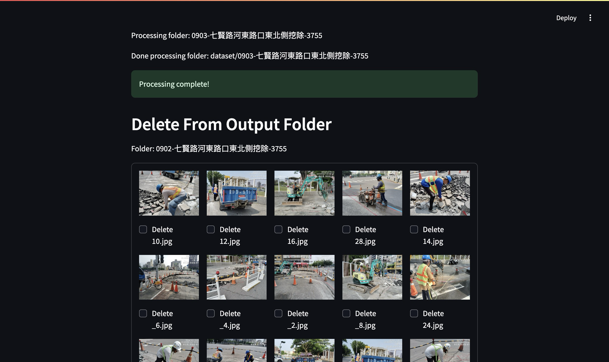

# Image Processing Tool

這是一個基於 Streamlit 的圖像處理工具，用於處理和刪除圖像。該工具將從指定的輸入資料夾中複製經過處理的圖像到輸出資料夾，並提供用戶界面以刪除不需要的圖像。

## 功能

- **圖像處理**：從指定的輸入資料夾中讀取圖像並進行處理，輸出到指定的資料夾。
- **圖像刪除**：顯示輸出資料夾中的圖像，允許用戶選擇並刪除不需要的圖像。
- **清空資料夾**：可以選擇刪除整個輸出資料夾。

## 依賴項

本專案需要以下 Python 套件：

- `streamlit`
- `Pillow`
- `opencv-python`
- `numpy`

您可以使用以下命令安裝所有依賴項：

```bash
pip install -r requirements.txt
```

## 使用說明

1. **啟動應用程序**：
   使用以下命令啟動 Streamlit 應用程序：

   ```bash
   streamlit run classifier.py
   ```

2. **選擇資料夾**：
   在應用界面中，輸入要處理的輸入資料夾路徑和輸出資料夾路徑。

3. **開始處理**：
   點擊「Start Processing」按鈕以開始處理圖像。處理完成後，您可以查看經過處理的圖像。

4. **刪除圖像**：
   在「Delete From Output Folder」部分中，您可以查看輸出資料夾中的圖像並選擇要刪除的圖像。

5. **清空輸出資料夾**：
   如果需要，可以點擊「Clear Output Directory」按鈕以刪除整個輸出資料夾。

## 函數詳解

### process_images()

此函數從 `input_directory` 中處理圖像並將結果保存到 `output_directory`。支持的參數包括：

- `input_directory`: 輸入資料夾的路徑。
- `output_directory`: 輸出資料夾的路徑，默認為 `'output/'`。
- `crop_coords`: 裁剪圖像的坐標，格式為 `(top, bottom, left, right)`。
- `kernel_size`: 用於形態學操作的核大小。
- `output`: 是否將處理後的圖像保存到輸出資料夾。

### copy_processed_images_from_folders()

該函數從 `input_directory` 中的每個子資料夾處理圖像，並將結果複製到 `output_directory` 中。

### display_and_select_images_for_deletion(output_directory)

此函數顯示輸出資料夾中的圖像，並提供選擇刪除的功能。
